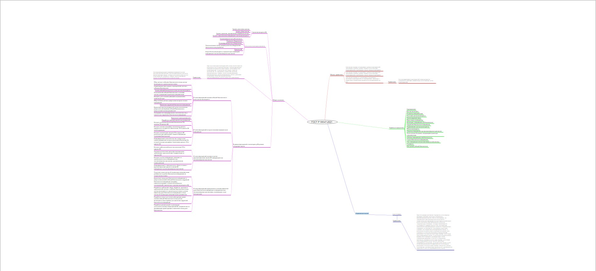
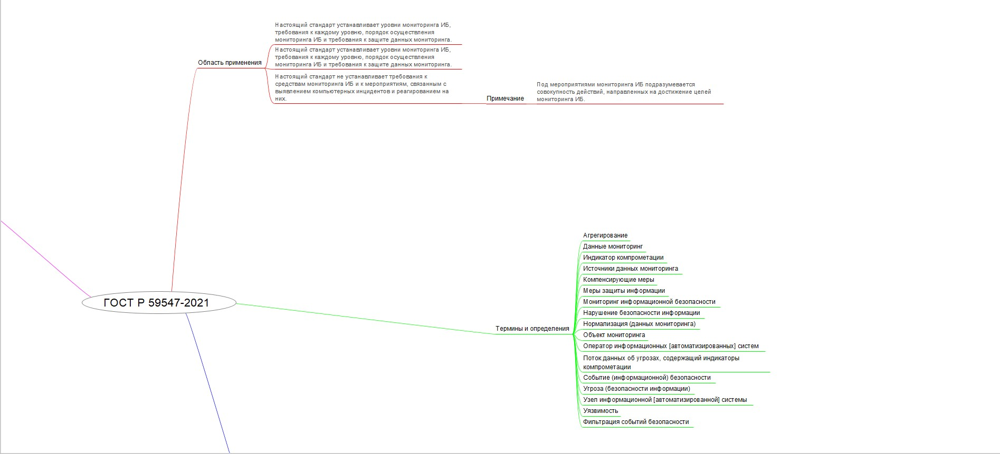
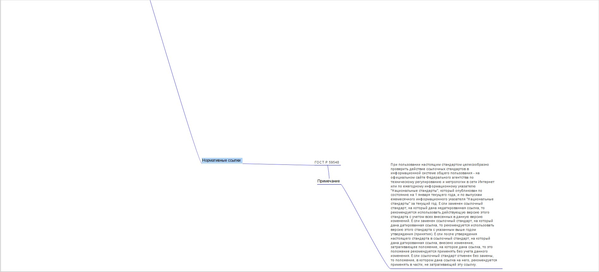
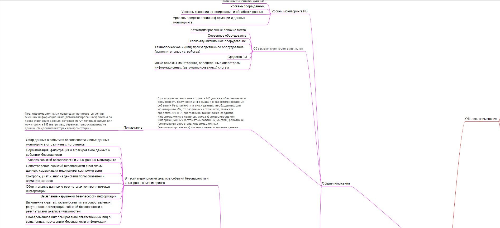
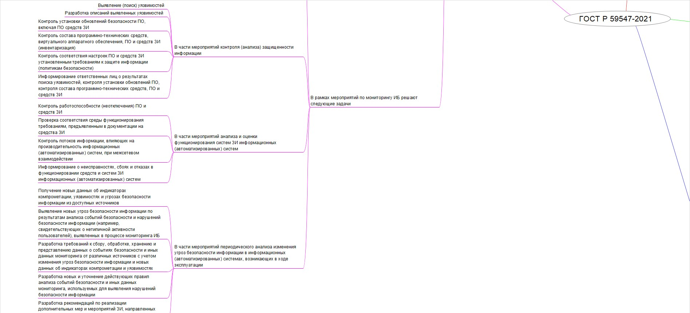

Работа с ментальной картой
================
Поташук А.А. БИСО-01-20

## Цель работы

Изучить ГОСТ по защите информации и познакомиться с построением
mind-карты

## Ход работы

Для построения mind-карты был взят ГОСТ Р 59547-2021 Защита информации
Мониторинг информационной безопасности.

Ссылка на документ - https://docs.cntd.ru/document/1200180385

Была использована программа Freeplane

Результат

## Оценка результата

Был изучен ГОСТ Р 59547-2021 Защита информации Мониторинг информационной
безопасности. Основные термины и определения и была построена mind-карта
в программе Freeplane.

## Вывод

Таким образом, был изучен ГОСТ и правила построения mind-карт.
