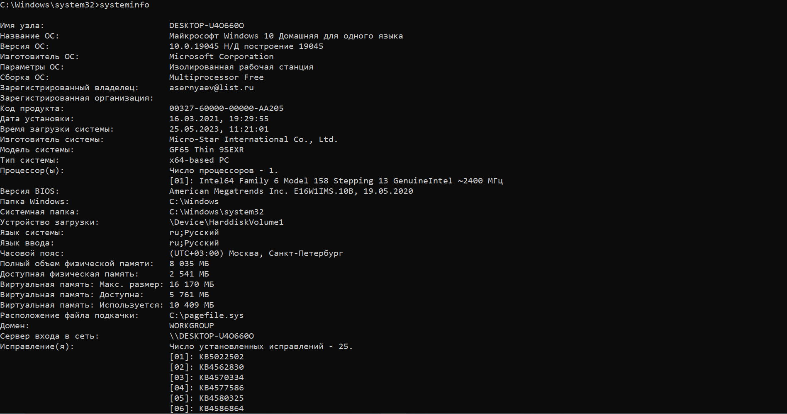
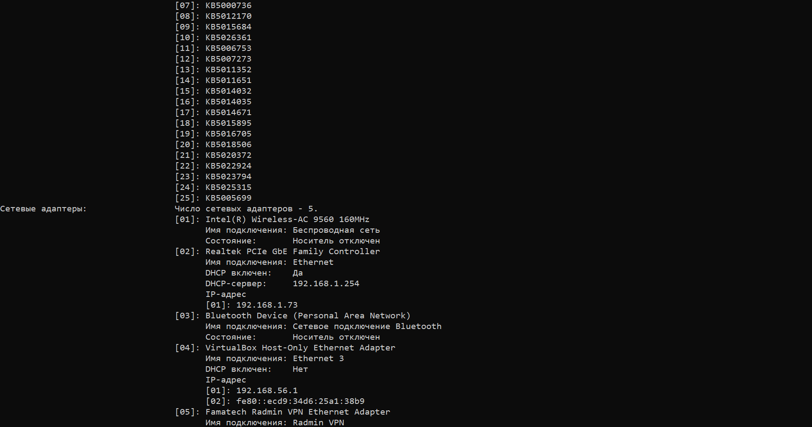
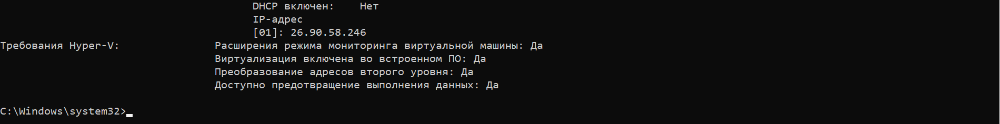
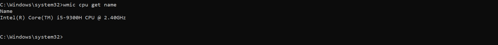
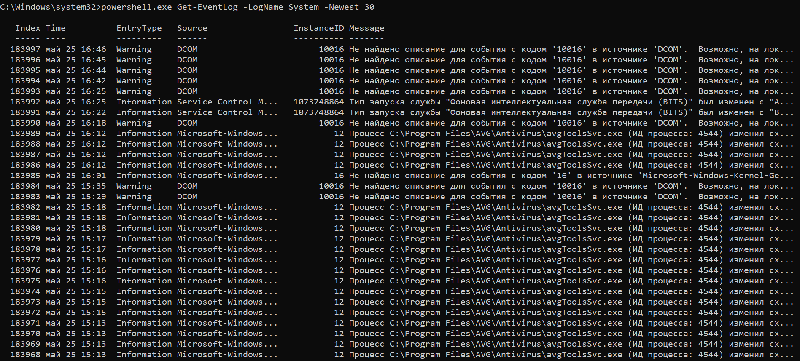

Lab_1
================
Поташук А.А. БИСО-01-20

# Системы аутентификации и защиты от несанкционированного доступа

Лабораторная работа №1

## Цель

Получить сведения об используемой системе

## Исходные данные

1.  Ноутбук MSI GF65 Thin 9SEXR
2.  ОС Windows 10

## План

1.  Выполнить команду systeminfo
2.  Выполнить команду wmic cpu get name
3.  Выполнить команду powershell.exe Get-EventLog -LogName System
    -Newest 30

## Шаги

Получим информацию об используемой системе вводом команды systeminfo:

  

Далее команда wmic cpu get name для вывода информации о процессоре:

Также выполним команду powershell.exe Get-EventLog -LogName System
-Newest 30 для вывода логов

## Оценка результата

В результате лабораторной работы мы получили основную информацию об ОС,
процессоре и логи системы.

## Вывод

Таким образом, мы научились работать с базовыми командами командой
строки и получать информацию об операционной системе.
